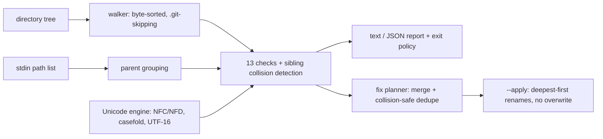

# namefence

[English](README.md) | [中文](README.zh.md) | [日本語](README.ja.md)

[](LICENSE) [](Cargo.toml)  [](CONTRIBUTING.md)

**Windows・macOS・クラウド同期で壊れるファイル名を検出するオープンソースの linter——予約名、NFC/NFD 重複、大文字小文字衝突、長さ超過を、衝突しない修正案付きで報告する。**


```bash
git clone https://github.com/JaydenCJ/namefence.git && cargo install --path namefence
```

> プレリリース：0.1.0 はまだ crates.io に公開されていない——上記のクローン＆インストールが正規の導入手順。

## なぜ namefence？

作られた環境では完全に合法なファイル名が、別の場所ではチェックアウトも開くことも同期もできないことがある：Windows は `aux.txt` を予約し `report:final.csv` を拒否し、末尾のドットと空白を黙って剥ぎ取り、`README.md` と `readme.md` を 1 つのファイルに併合する。macOS は `café` を分解形の Unicode に再エンコードし、バイト比較する同期ツールは永遠に再アップロードを繰り返す。Dropbox や OneDrive は各自の予約名を黙ってスキップする。Syncthing や Dropbox のフォーラムに溢れているのはまさにこれらの障害であり、定番の答え——detox のような文字サニタイザ——は記号以外を全部見逃す。これらは*ルール*であって、悪い文字ではないからだ。namefence はルールをコードにした：13 の専用チェックの背後に本物の正準 Unicode 正規化があり、修正プランナーの提案するリネームは、残される名前と（大文字小文字でも正規化でも）決して衝突しないことが保証される。

|  | namefence | detox | git `core.protectNTFS` | クラウド側のエラー |
|---|---|---|---|---|
| 位置づけ | 可搬性 linter + 修正器 | 文字サニタイザ | チェックアウト時の防御 | 事後の拒否 |
| 予約デバイス名（`aux.txt`、`COM¹`） | 対応、拡張子付きでも | 非対応 | チェックアウト時のみ | OneDrive がアップロードを拒否 |
| NFC/NFD 重複（Mac 往復の産物） | 対応——完全な UAX #15 正規化 | 非対応 | 非対応 | 非対応——同期が*作り出す*側 |
| ext4 上での大小文字衝突の検出 | 対応、Unicode ケースフォールド | 非対応 | 非対応 | 後から競合コピーが出現 |
| 修正戦略 | 衝突しないリネーム計画、既定はドライラン | 文字を剥ぐ/置換 | ファイルを拒否 | なし |
| ファイルに触れない純粋 lint | 対応（`check`、`stdin`） | 非対応——本体がリネーマ | — | — |
| CI 向け JSON + 終了コード | 対応 | 非対応 | — | — |
| 実行時依存 | 0 crate、std のみ | libc、iconv | git に同梱 | — |

## 特徴

- **文字剥ぎではなくルール** —— 13 のチェックが名前が*なぜ*壊れるかを符号化：拡張子付きでも効く Windows デバイス名（`aux.tar.gz`）、Win32 の末尾ドット黙殺、ディレクトリ内の大小文字・正規化衝突、二重の 255 単位長さ予算（UTF-8 バイト*と* UTF-16 単位）、クラウドクライアントの黙殺リスト、不正な UTF-8。
- **純 std による本物の Unicode 正規化** —— UAX #15 準拠の正準 NFC/NFD をゼロから実装：完全分解、正準並べ替え、ブロッキング付き合成、アルゴリズム的ハングル、UnicodeData.txt から生成したテーブル駆動。`café` と `café` の違いが検出可能なのはこのため。
- **機械的な問題には必ず修正が付く** —— 検出結果は具体的なリネームを提示し（`aux.txt` → `aux_.txt`、`:` → `-`、NFD → NFC）、`namefence fix` は 1 つの名前の全問題を 1 回の最終リネームに統合する。
- **構造的に衝突しない** —— 計画された名前は、残される兄弟や他の計画項目と大小文字・正規化の意味で決して衝突しない。競合は番号付け（`readme-2.md`）で回避し、リネームは最深ディレクトリから適用、`--apply` は上書きを拒否する。汎用サニタイザはこの工程を飛ばす。「直した」ツリーが Windows 上でファイルを上書きするのはそのせいだ。
- **ディスクだけでなくリストも lint** —— `git ls-files -z | namefence stdin -0` は git が追跡しているものだけを、パス横断の衝突検出込みで、ファイルシステムに触れずに検査する。
- **プラットフォームプロファイル** —— Dropbox 前の点検には `--targets cloud`、Windows チームへの共有前には `--targets windows`。各チェックは問題が実際にどこで発火するかを宣言している。
- **CI 対応で正直** —— 安定した JSON、`--fail-on` 重大度ポリシー、バイト順ソートの決定的出力。打ち切られた走査は完全なふりをせず「部分的」と明記される。

## クイックスタート

インストール（Rust 1.75+ が必要）：

```bash
git clone https://github.com/JaydenCJ/namefence.git && cargo install --path namefence
```

同期直前のディレクトリを lint する：

```bash
namefence check ~/Sync
```

出力（実際にキャプチャした実行結果）：

```text
aux.txt: error NF001 (windows-reserved-name): `aux.txt` has the reserved DOS device stem `AUX`; Windows cannot create, open or delete it
    fix: rename to `aux_.txt`
docs/readme.md: error NF006 (case-collision): `readme.md` collides with sibling `README.md` on case-insensitive filesystems (Windows, macOS default)
photos/café.jpg: warning NF008 (non-nfc): `café.jpg` is not NFC-normalized (9 code points; the NFC form has 8); byte-comparing sync tools treat the two encodings as different files
    fix: rename to `café.jpg`
report:final.csv: error NF002 (windows-illegal-char): `report:final.csv` contains 1 Windows-forbidden character(s): `:`
    fix: rename to `report-final.csv`

findings: 4 — 3 error(s), 1 warning(s), 0 info; 5 file(s), 2 directory(ies) scanned
```

検出があれば終了コード 1——同じコマンドがそのまま CI のゲートになる。`namefence fix` は統合済みの衝突しない計画を何も変更せずに表示し、`--apply` を付けたときだけ実行する：

```text
$ namefence fix --apply ~/Sync
renamed `docs/readme.md` -> `readme-2.md`  (NF006/NF007)
renamed `photos/café.jpg` -> `café.jpg`  (NF008)
renamed `aux.txt` -> `aux_.txt`  (NF001)
renamed `report:final.csv` -> `report-final.csv`  (NF002)
applied 4 rename(s)
```

git が追跡しているものだけでリポジトリにゲートを敷く。ディスク走査は不要：

```bash
git ls-files -z | namefence stdin -0 --fail-on error
```

`bash examples/demo.sh` は全問題クラスを 1 つずつ含む使い捨てツリーを組み立て、上記すべてを通しで実演する。

## チェック一覧

`namefence checks` がカタログを列挙し、`namefence explain NF007` が各チェックの背景を語る。重大度とターゲットの意味論、エンジンの忠実度と既知の逸脱は [docs/checks.md](docs/checks.md) を参照。

| ID | 名前 | 重大度 | 壊れる場所 |
|---|---|---|---|
| NF001 | windows-reserved-name | error | windows, cloud |
| NF002 | windows-illegal-char | error | windows, cloud |
| NF003 | control-character | error | windows, cloud |
| NF004 | trailing-dot-or-space | error | windows, cloud |
| NF005 | leading-space | warning | windows, cloud |
| NF006 | case-collision | error | windows, macos, cloud |
| NF007 | normalization-collision | error | macos, cloud |
| NF008 | non-nfc | warning | macos, cloud |
| NF009 | invisible-character | warning | 4 つすべて |
| NF010 | component-too-long | error | 4 つすべて |
| NF011 | path-too-long | warning | windows, cloud |
| NF012 | cloud-reserved-name | warning | cloud |
| NF013 | invalid-utf8 | error | windows, macos, cloud |

`check`・`fix`・`stdin` が共有するオプション：

| Key | 既定値 | 効果 |
|---|---|---|
| `--fail-on` | `warning` | この重大度以上で終了コード 1（`never` は常に 0） |
| `--targets` | 4 つすべて | 問題がこれらのプラットフォームで発火するチェックだけ実行 |
| `--only` / `--skip` | 全チェック | ID か名前でチェックを選択、カンマ区切り |
| `--format` | `text` | `json` は安定した機械可読レポートを出力 |
| `--max-path` | `240` | NF011 の予算、スキャンルート起点の UTF-16 単位数 |
| `--max-files` | `200000` | 走査上限。打ち切りは「部分的」と明記され、黙殺されない |

同じ選択が `fix` にも効く：スキップされたチェックは修正ステージとしてもスキップされるため、`fix --targets windows` が名前を NFC に再エンコードすることはない。

## 検証

このリポジトリは CI を持たない。上記の主張はすべてローカル実行で検証されている：`cargo test`（単体 81 + CLI 統合 17 テスト）と `bash scripts/smoke.sh`——後者は check → fix → apply → 収束をエンドツーエンドで演練し、`SMOKE OK` を印字しなければならない。

## アーキテクチャ



## ロードマップ

- [x] コアエンジン：13 チェックのカタログ、std 内での UAX #15 正規化、`--apply` 付き衝突回避修正プランナー、stdin モード、プラットフォームプロファイル、JSON 出力
- [ ] vendored サブツリー（node_modules の類）を除外する `--exclude` glob パターン
- [ ] プロジェクトの方針をコードと一緒にコミットする設定ファイル（`.namefence.toml`）
- [ ] API から名前を UTF-16 のまま読む Windows ネイティブ実行モード
- [ ] macOS 慣習に統一するチーム向けの NFD ターゲットプロファイル（オプション）
- [ ] 新しい UCD リリースに合わせた Unicode テーブルの再生成

完全なリストは [open issues](https://github.com/JaydenCJ/namefence/issues) を参照。

## コントリビュート

貢献を歓迎します——[CONTRIBUTING.md](CONTRIBUTING.md) を読み、[good first issue](https://github.com/JaydenCJ/namefence/issues?q=is%3Aissue+is%3Aopen+label%3A%22good+first+issue%22) から始めるか、[discussion](https://github.com/JaydenCJ/namefence/discussions) を立ててください。

## ライセンス

[MIT](LICENSE)
