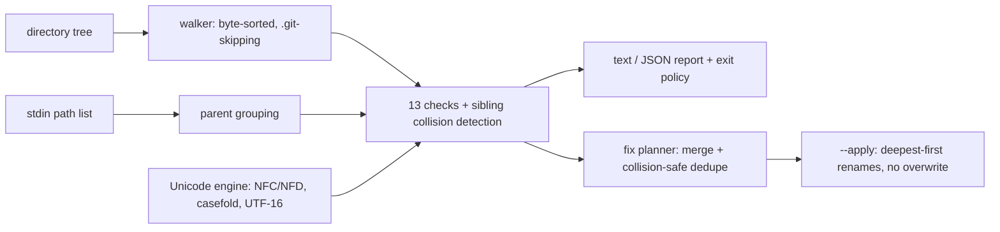

# namefence

[English](README.md) | [中文](README.zh.md) | [日本語](README.ja.md)

[](LICENSE) [](Cargo.toml)  [](CONTRIBUTING.md)

**An open-source linter for filenames that will break on Windows, macOS, or cloud sync — reserved names, NFC/NFD duplicates, case collisions, length limits, each with a collision-safe fix suggestion.**


```bash
git clone https://github.com/JaydenCJ/namefence.git && cargo install --path namefence
```

> Pre-release: 0.1.0 is not yet on crates.io — the clone-and-install above is the supported path.

## Why namefence?

A filename that is perfectly legal where it was created can be impossible to check out, open, or sync anywhere else: Windows reserves `aux.txt` and rejects `report:final.csv`, silently strips trailing dots and spaces, and merges `README.md` with `readme.md`; macOS re-encodes `café` into decomposed Unicode so byte-comparing sync tools re-upload it forever; Dropbox and OneDrive quietly skip their own reserved names. Syncthing and Dropbox forums overflow with exactly these failures, and the classic answer — run a character sanitizer like detox — misses every one of them except the punctuation, because these are *rules*, not bad characters. namefence encodes the rules: thirteen purpose-built checks with real canonical Unicode normalization behind them, and a fix planner whose suggested renames are guaranteed not to collide (case- or normalization-insensitively) with anything kept.

|  | namefence | detox | git `core.protectNTFS` | cloud client errors |
|---|---|---|---|---|
| What it is | portability linter + fixer | character sanitizer | checkout-time guard | after-the-fact rejection |
| Reserved device names (`aux.txt`, `COM¹`) | yes, any extension | no | at checkout only | OneDrive rejects at upload |
| NFC/NFD duplicates (Mac round-trip) | yes — full UAX #15 normalization | no | no | no — syncing *creates* them |
| Case collisions found on ext4 | yes, Unicode case folding | no | no | conflict copies, later |
| Fix strategy | collision-safe rename plan, dry-run first | strips/maps characters | refuses the file | none |
| Lint without touching files | yes (`check`, `stdin`) | no — it is a renamer | — | — |
| JSON + exit codes for CI | yes | no | — | — |
| Runtime dependencies | 0 crates, std only | libc, iconv | ships with git | — |

## Features

- **Rules, not character stripping** — 13 checks encode *why* names break: Windows device stems with any extension (`aux.tar.gz`), Win32 trailing-dot stripping, per-directory case and normalization collisions, both 255-unit length budgets (UTF-8 bytes *and* UTF-16 units), cloud clients' silent-skip lists, invalid UTF-8.
- **Real Unicode normalization in pure std** — canonical NFC/NFD per UAX #15, implemented from scratch: full decomposition, canonical reordering, composition with blocking, algorithmic Hangul, driven by tables generated from UnicodeData.txt. That is what makes `café` vs `café` detectable at all.
- **Every mechanical problem carries its fix** — findings suggest the concrete rename (`aux.txt` → `aux_.txt`, `:` → `-`, NFD → NFC), and `namefence fix` merges all of a name's problems into one final rename.
- **Collision-safe by construction** — a planned name never case- or normalization-collides with a kept sibling or another plan entry; conflicts get numbered bumps (`readme-2.md`), renames apply deepest-first, and `--apply` refuses to overwrite. Generic sanitizers skip this step; that is how a "fixed" tree overwrites files on Windows.
- **Lints listings, not just disks** — `git ls-files -z | namefence stdin -0` checks exactly what git tracks, including cross-path collision detection, without touching the filesystem.
- **Platform profiles** — `--targets cloud` for a Dropbox pre-flight, `--targets windows` before sharing with a Windows team; every check declares where its problem actually breaks.
- **CI-ready and honest** — stable JSON, `--fail-on` severity policy, deterministic byte-sorted output, and truncated walks are labelled as partial instead of pretending to be complete.

## Quickstart

Install (requires Rust 1.75+):

```bash
git clone https://github.com/JaydenCJ/namefence.git && cargo install --path namefence
```

Lint a directory about to be synced:

```bash
namefence check ~/Sync
```

Output (real captured run):

```text
aux.txt: error NF001 (windows-reserved-name): `aux.txt` has the reserved DOS device stem `AUX`; Windows cannot create, open or delete it
    fix: rename to `aux_.txt`
docs/readme.md: error NF006 (case-collision): `readme.md` collides with sibling `README.md` on case-insensitive filesystems (Windows, macOS default)
photos/café.jpg: warning NF008 (non-nfc): `café.jpg` is not NFC-normalized (9 code points; the NFC form has 8); byte-comparing sync tools treat the two encodings as different files
    fix: rename to `café.jpg`
report:final.csv: error NF002 (windows-illegal-char): `report:final.csv` contains 1 Windows-forbidden character(s): `:`
    fix: rename to `report-final.csv`

findings: 4 — 3 error(s), 1 warning(s), 0 info; 5 file(s), 2 directory(ies) scanned
```

Findings exit 1, so the same command is a CI gate. `namefence fix` prints the merged, collision-safe plan without touching anything; add `--apply` to execute it:

```text
$ namefence fix --apply ~/Sync
renamed `docs/readme.md` -> `readme-2.md`  (NF006/NF007)
renamed `photos/café.jpg` -> `café.jpg`  (NF008)
renamed `aux.txt` -> `aux_.txt`  (NF001)
renamed `report:final.csv` -> `report-final.csv`  (NF002)
applied 4 rename(s)
```

Gate a repository on exactly what git tracks, no walk needed:

```bash
git ls-files -z | namefence stdin -0 --fail-on error
```

`bash examples/demo.sh` builds a throwaway tree with one of every problem and walks through all of it.

## Checks

`namefence checks` lists the catalog; `namefence explain NF007` tells the full story of any check. Severity and target semantics, engine-fidelity notes and known deviations live in [docs/checks.md](docs/checks.md).

| ID | Name | Severity | Breaks on |
|---|---|---|---|
| NF001 | windows-reserved-name | error | windows, cloud |
| NF002 | windows-illegal-char | error | windows, cloud |
| NF003 | control-character | error | windows, cloud |
| NF004 | trailing-dot-or-space | error | windows, cloud |
| NF005 | leading-space | warning | windows, cloud |
| NF006 | case-collision | error | windows, macos, cloud |
| NF007 | normalization-collision | error | macos, cloud |
| NF008 | non-nfc | warning | macos, cloud |
| NF009 | invisible-character | warning | all four |
| NF010 | component-too-long | error | all four |
| NF011 | path-too-long | warning | windows, cloud |
| NF012 | cloud-reserved-name | warning | cloud |
| NF013 | invalid-utf8 | error | windows, macos, cloud |

The knobs shared by `check`, `fix` and `stdin`:

| Key | Default | Effect |
|---|---|---|
| `--fail-on` | `warning` | exit 1 at this severity or above (`never` always exits 0) |
| `--targets` | all four | only run checks whose problem breaks on these platforms |
| `--only` / `--skip` | all checks | select checks by ID or name, comma-separated |
| `--format` | `text` | `json` emits a stable machine-readable report |
| `--max-path` | `240` | NF011 budget in UTF-16 units, relative to the scan root |
| `--max-files` | `200000` | walk cap; a truncated walk is labelled partial, never silent |

The same selection shapes `fix`: skipped checks are also skipped as fix stages, so `fix --targets windows` re-encodes nothing to NFC.

## Verification

This repository ships no CI; every claim above is verified by local runs: `cargo test` (81 unit + 17 CLI integration tests) and `bash scripts/smoke.sh`, which exercises check → fix → apply → convergence end to end and must print `SMOKE OK`.

## Architecture



## Roadmap

- [x] Core engine: 13-check catalog, UAX #15 canonical normalization in std, collision-safe fix planner with `--apply`, stdin mode, platform targets, JSON output
- [ ] `--exclude` glob patterns for vendored subtrees (node_modules and friends)
- [ ] Config file (`.namefence.toml`) committing a project's policy alongside the code
- [ ] Windows-native run mode reading names as UTF-16 directly from the API
- [ ] Optional NFD target profile for teams standardizing on macOS conventions
- [ ] Regenerate Unicode tables against newer UCD releases as they ship

See the [open issues](https://github.com/JaydenCJ/namefence/issues) for the full list.

## Contributing

Contributions are welcome — see [CONTRIBUTING.md](CONTRIBUTING.md), start with a [good first issue](https://github.com/JaydenCJ/namefence/issues?q=is%3Aissue+is%3Aopen+label%3A%22good+first+issue%22) or open a [discussion](https://github.com/JaydenCJ/namefence/discussions).

## License

[MIT](LICENSE)
