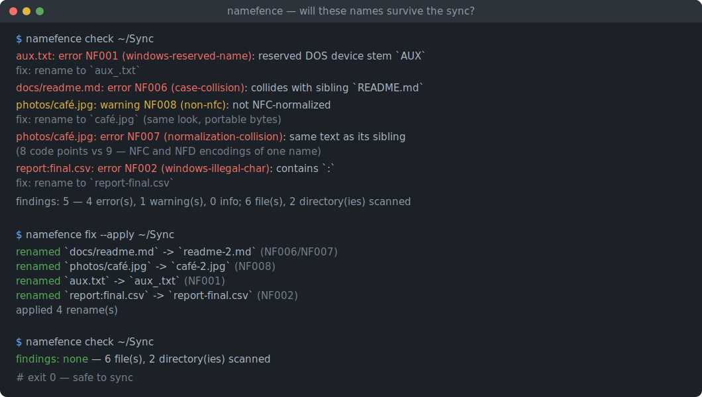
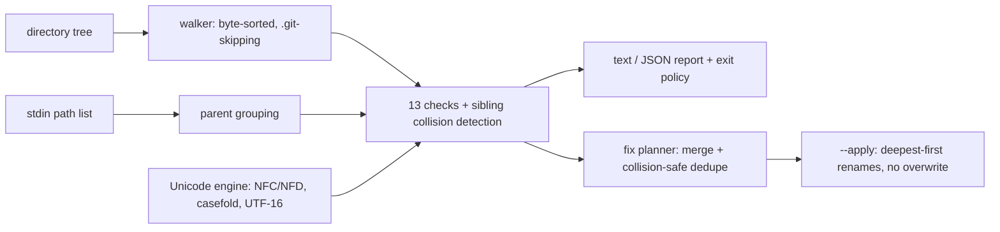

# namefence

[English](README.md) | [中文](README.zh.md) | [日本語](README.ja.md)

[](LICENSE) [](Cargo.toml)  [](CONTRIBUTING.md)

**开源的文件名 lint 工具，专查会在 Windows、macOS 或云同步上出问题的文件名——保留名、NFC/NFD 重复、大小写冲突、长度超限，每一项都附带防冲突的修复建议。**



```bash
git clone https://github.com/JaydenCJ/namefence.git && cargo install --path namefence
```

> 预发布：0.1.0 尚未发布到 crates.io——请按上面的方式克隆源码安装。

## 为什么选 namefence？

一个在创建它的系统上完全合法的文件名，换个地方就可能无法检出、无法打开、无法同步：Windows 保留 `aux.txt`、拒绝 `report:final.csv`，会悄悄去掉结尾的点和空格，还把 `README.md` 和 `readme.md` 合并成一个文件；macOS 会把 `café` 重编码为分解形式的 Unicode，逐字节比较的同步工具因此永远在重复上传；Dropbox 和 OneDrive 会默默跳过它们各自的保留名。Syncthing 和 Dropbox 论坛上堆满的正是这些故障，而经典答案——跑一个 detox 之类的字符清洗器——除了标点以外全都漏掉，因为这些是*规则*，不是坏字符。namefence 把规则写成了代码：十三条专门设计的检查，背后是真正的 Unicode 规范化实现，还有一个修复规划器，其建议的重命名保证不会（无论大小写还是规范化意义上）与任何保留的名字相撞。

|  | namefence | detox | git `core.protectNTFS` | 云客户端报错 |
|---|---|---|---|---|
| 定位 | 可移植性 linter + 修复器 | 字符清洗器 | 检出时的防护 | 事后拒绝 |
| 保留设备名（`aux.txt`、`COM¹`） | 是，任何扩展名 | 否 | 仅在检出时 | OneDrive 上传时拒绝 |
| NFC/NFD 重复（Mac 往返产物） | 是——完整 UAX #15 规范化 | 否 | 否 | 否——同步*制造*它们 |
| 在 ext4 上发现大小写冲突 | 是，Unicode 大小写折叠 | 否 | 否 | 冲突副本，事后才出现 |
| 修复策略 | 防冲突的重命名计划，默认演练 | 剥离/替换字符 | 拒绝该文件 | 无 |
| 不碰文件的纯 lint | 是（`check`、`stdin`） | 否——它就是个重命名器 | — | — |
| 面向 CI 的 JSON + 退出码 | 是 | 否 | — | — |
| 运行时依赖 | 0 个 crate，仅 std | libc、iconv | 随 git 附带 | — |

## 特性

- **规则，而不是剥字符** —— 13 条检查编码了名字*为什么*会坏：带任何扩展名的 Windows 设备名（`aux.tar.gz`）、Win32 对结尾点的静默剥除、目录内的大小写与规范化冲突、两套 255 单位长度预算（UTF-8 字节*和* UTF-16 单元）、云客户端的静默跳过清单、非法 UTF-8。
- **纯 std 实现的真正 Unicode 规范化** —— 按 UAX #15 从零实现的规范 NFC/NFD：完整分解、规范重排、带阻断规则的组合、算法化谚文，数据表由 UnicodeData.txt 生成。正因为如此，`café` 与 `café` 的差异才可能被检测出来。
- **每个机械问题都带修复** —— 发现项直接给出具体重命名（`aux.txt` → `aux_.txt`、`:` → `-`、NFD → NFC），`namefence fix` 把一个名字的所有问题合并成一次最终重命名。
- **构造上防冲突** —— 计划中的名字绝不会与保留的兄弟项或另一条计划在大小写或规范化意义上相撞；冲突自动编号（`readme-2.md`），重命名按最深目录优先执行，`--apply` 拒绝覆盖已有文件。通用清洗器跳过这一步；"修好"的目录树在 Windows 上覆盖文件就是这么来的。
- **能 lint 清单，不只 lint 磁盘** —— `git ls-files -z | namefence stdin -0` 精确检查 git 跟踪的内容，包括跨路径冲突检测，完全不触碰文件系统。
- **平台画像** —— `--targets cloud` 做 Dropbox 起飞前检查，`--targets windows` 在共享给 Windows 团队前使用；每条检查都声明它的问题究竟在哪里发作。
- **CI 就绪且诚实** —— 稳定的 JSON、`--fail-on` 严重度策略、按字节排序的确定性输出，被截断的遍历会标注为部分结果而不是假装完整。

## 快速上手

安装（需要 Rust 1.75+）：

```bash
git clone https://github.com/JaydenCJ/namefence.git && cargo install --path namefence
```

对一个即将同步的目录做 lint：

```bash
namefence check ~/Sync
```

输出（真实捕获的运行结果）：

```text
aux.txt: error NF001 (windows-reserved-name): `aux.txt` has the reserved DOS device stem `AUX`; Windows cannot create, open or delete it
    fix: rename to `aux_.txt`
docs/readme.md: error NF006 (case-collision): `readme.md` collides with sibling `README.md` on case-insensitive filesystems (Windows, macOS default)
photos/café.jpg: warning NF008 (non-nfc): `café.jpg` is not NFC-normalized (9 code points; the NFC form has 8); byte-comparing sync tools treat the two encodings as different files
    fix: rename to `café.jpg`
report:final.csv: error NF002 (windows-illegal-char): `report:final.csv` contains 1 Windows-forbidden character(s): `:`
    fix: rename to `report-final.csv`

findings: 4 — 3 error(s), 1 warning(s), 0 info; 5 file(s), 2 directory(ies) scanned
```

有发现项就退出 1，同一条命令即是 CI 关卡。`namefence fix` 打印合并后的防冲突计划而不动任何东西；加 `--apply` 才执行：

```text
$ namefence fix --apply ~/Sync
renamed `docs/readme.md` -> `readme-2.md`  (NF006/NF007)
renamed `photos/café.jpg` -> `café.jpg`  (NF008)
renamed `aux.txt` -> `aux_.txt`  (NF001)
renamed `report:final.csv` -> `report-final.csv`  (NF002)
applied 4 rename(s)
```

只按 git 跟踪的内容为仓库设卡，无需遍历磁盘：

```bash
git ls-files -z | namefence stdin -0 --fail-on error
```

`bash examples/demo.sh` 会搭一棵包含每类问题各一个的临时目录树，并完整演示以上全部。

## 检查项

`namefence checks` 列出目录；`namefence explain NF007` 讲清任意检查的来龙去脉。严重度与目标语义、引擎保真度说明和已知偏差见 [docs/checks.md](docs/checks.md)。

| ID | 名称 | 严重度 | 影响平台 |
|---|---|---|---|
| NF001 | windows-reserved-name | error | windows, cloud |
| NF002 | windows-illegal-char | error | windows, cloud |
| NF003 | control-character | error | windows, cloud |
| NF004 | trailing-dot-or-space | error | windows, cloud |
| NF005 | leading-space | warning | windows, cloud |
| NF006 | case-collision | error | windows, macos, cloud |
| NF007 | normalization-collision | error | macos, cloud |
| NF008 | non-nfc | warning | macos, cloud |
| NF009 | invisible-character | warning | 全部四个 |
| NF010 | component-too-long | error | 全部四个 |
| NF011 | path-too-long | warning | windows, cloud |
| NF012 | cloud-reserved-name | warning | cloud |
| NF013 | invalid-utf8 | error | windows, macos, cloud |

`check`、`fix`、`stdin` 共享的旋钮：

| Key | 默认值 | 效果 |
|---|---|---|
| `--fail-on` | `warning` | 达到该严重度即退出 1（`never` 恒为 0） |
| `--targets` | 全部四个 | 只运行其问题会在这些平台发作的检查 |
| `--only` / `--skip` | 全部检查 | 按 ID 或名称选择检查，逗号分隔 |
| `--format` | `text` | `json` 输出稳定的机器可读报告 |
| `--max-path` | `240` | NF011 预算，UTF-16 单元数，相对扫描根 |
| `--max-files` | `200000` | 遍历上限；被截断的遍历会标注为部分，绝不沉默 |

同样的选择也塑造 `fix`：被跳过的检查同时作为修复阶段被跳过，所以 `fix --targets windows` 不会把任何名字重编码成 NFC。

## 验证

本仓库不带 CI；上述每一条主张都由本地运行验证：`cargo test`（81 个单元测试 + 17 个 CLI 集成测试）和 `bash scripts/smoke.sh`——后者端到端演练 check → fix → apply → 收敛，必须打印 `SMOKE OK`。

## 架构



## 路线图

- [x] 核心引擎：13 条检查目录、std 内实现的 UAX #15 规范化、带 `--apply` 的防冲突修复规划器、stdin 模式、平台画像、JSON 输出
- [ ] `--exclude` glob 模式，跳过 vendored 子树（node_modules 之流）
- [ ] 配置文件（`.namefence.toml`），把项目策略与代码一起提交
- [ ] Windows 原生运行模式，直接从 API 以 UTF-16 读取名字
- [ ] 可选的 NFD 目标画像，供统一采用 macOS 惯例的团队使用
- [ ] 随新版 UCD 发布重新生成 Unicode 数据表

完整清单见 [open issues](https://github.com/JaydenCJ/namefence/issues)。

## 参与贡献

欢迎贡献——请看 [CONTRIBUTING.md](CONTRIBUTING.md)，从一个 [good first issue](https://github.com/JaydenCJ/namefence/issues?q=is%3Aissue+is%3Aopen+label%3A%22good+first+issue%22) 入手，或发起一个 [discussion](https://github.com/JaydenCJ/namefence/discussions)。

## 许可证

[MIT](LICENSE)
